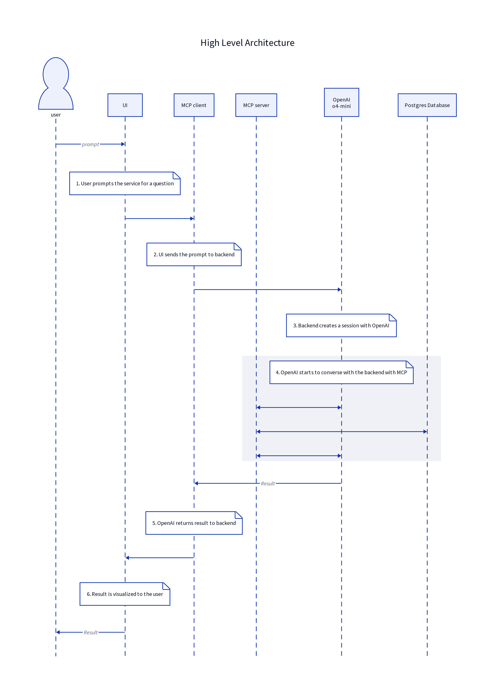

# VectorQuerycorns 🦄
AI agent that can do complicated queries to answer the users question

Link to our google slides where we have some basic info about this project and interesting queries if you missed them in our project description!
[Link to google slides](https://docs.google.com/presentation/d/1lmrZfQ6yIltcm_q985mqo_saP6y-wPMPbO4fbmJZro4/edit?usp=sharing>)


## Full deployment

For you to get yor own service running on your own machine, you will need:

- docker & docker compose https://docs.docker.com/get-started/get-docker/
- openai api token. You will need to save this in a file called `.env` like below

```
OPENAI_API_KEY=<sanitized>
```

If anyone wants to try to set this up on their own machine, we can provide a token for limited use (until end of 2025/06/01).

Start the services with docker compose:

```
docker compose up
```

Then you should be able to navigate to [127.0.0.1:80](http://127.0.0.1:80) to open the ui.

**NOTE** please make sure you have initialized the dataset as submodule with `git submodule update --init`

## Architecture

Below is a high level image of our services architecture:



1. User inputs a natural language question to the UI. This question is later processed by LLM.
2. UI uses REST-api to post the question to the backend.
3. Backend creates a new session with OpenAI. Each session has it's own context and does not share it withother prompts. (In the future it could be possible to add follow-up questions to the original prompts which could make the accuracy of the responses better)
4. OpenAI uses Model Contex Protocol [(MCP)](https://modelcontextprotocol.io/introduction) to communicate with our server which spawns a new MCP-server for it to communicate with. This enables the LLM to for example create SQL queries.
5. After the LLM is happy with it's result, it will return it to the MCP-client which then can deserialize the LLM's response into structured (JSON) response for the ui.
6. The structured (JSON) response is visualized to the user.

## VectorQuerycorns Frontend 🦄

Frontend: https://vectorquerycorns.org  
Backend: https://vectorquerycorns.org/api/  
Backend docs: https://vectorquerycorns.org/api/docs#/default  


### Development Setup 

```
git clone https://github.com/Vesimies80/VectorQuerycorns.git
cd frontend
npm install
npm run dev
```

Open url: [http://localhost:3000](http://localhost:3000)

### TL;DR
The VectorQuerycorns frontend is a Next.js (v15) + Tailwind CSS chat‐style interface that connects to a FastAPI/OpenAI backend. On load, it retrieves a persistent userId (via /api/login) and fetches that user’s past prompts/responses (via /api/previous/proooooooompts), then displays them as right‐aligned prompt bubbles and left‐aligned response bubbles (responses may include charts rendered with D3). Users type or press Enter to send new prompts—the UI immediately shows a “loading” GIF until the backend reply arrives. Responses include a title, collapsible text, and an optional bar/pie/line chart (with dynamic, non‐overlapping legends for pie/line). Dark/light mode can be toggled (and is persisted in localStorage), and /api/* requests are automatically proxied to the FastAPI server via next.config.js.
    
### TL;DR of Each File
	•	layout.js: Sets page metadata, unicorn favicon, fonts, base Tailwind styles, and root structure.
	•	page.js: Coordinates state (dark mode, userId, conversations), fetches history, and renders chat interface.
	•	Header.js: Manages user authentication (via /api/login) and dark/light toggle UI.
	•	ChatInput.js: Controlled input for prompts; sends on Enter or button click.
	•	PromptBubble.jsx: Right‐aligned bubble styling for user prompts.
	•	ResponseBubble.jsx: Left‐aligned bubble for responses with “Collapse/Expand” and always‐black text.
	•	LoadingBubble.jsx: Shows a 300×300 loading.gif while waiting for a response.
	•	ChartVisualization.js: Renders D3 bar/pie/line charts with dynamic legends (except bar charts omit legend).
	•	MessageBubble.jsx: Generic bubble combining text + optional chart (light use).
	•	auth.js: Handles retrieving or creating a persistent userId via /api/login.
	•	api.js: Exposes queryBackend(...) and fetchPreviousPrompts(...) for all API calls.
